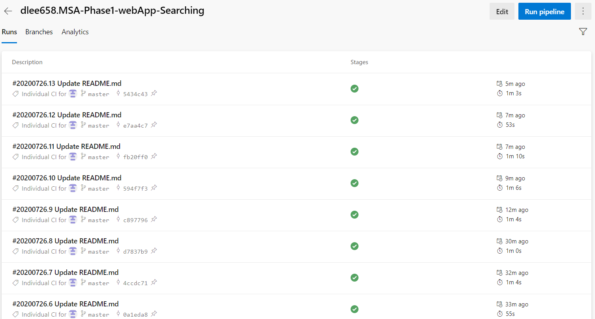
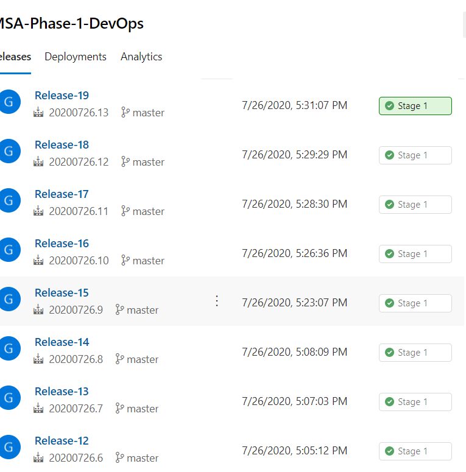

# 2020 MSA Phase-One Front end Path

## [Dictionary Web App](https://msa-phase-1-devops.azurewebsites.net/)

React Web App and Azure Pipeline

[Dictionary Web App](https://msa-phase-1-devops.azurewebsites.net/) is an image gallery react application.

By using google image API, created dictionary with searching bar that displays related image and description of user's searching term.

URL: https://msa-phase-1-devops.azurewebsites.net/

### The project is written using 

  -Typescript 
  
  -React.js 
  
  -Material-Ui 
  
  -3rd party REST API (Google image API) 
  
  
  ### Front page of dictionary web app
  
  
By using searching bar, search a term that you want to search for. Related images and descriptions will be display. 

The initial displaying images are searching with a term 'Apple'.  

The web application displays the term that user has been searched for.

### Pipelines

Used Azure DevOps pipelines to build and release pipelines of the project. It allows reliably and efficiently compile, build and deploy the react web app project.

